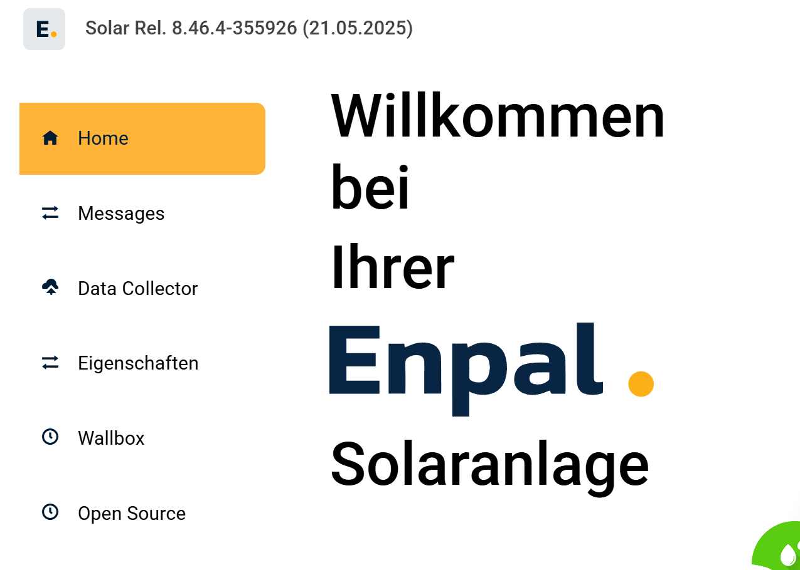

<p align="center">
  
</p>

# Enpal Solar – Home Assistant Integration

[](https://github.com/hacs/integration)
[](https://github.com/derolli1976/enpal)
[](https://github.com/derolli1976/enpal/releases)
[](https://github.com/derolli1976/enpal/actions/workflows/tests.yaml)
[](https://github.com/derolli1976/enpal/actions/workflows/codeql.yaml)
[](https://github.com/derolli1976/enpal/actions/workflows/bandit.yaml)
-blue)

[](https://my.home-assistant.io/redirect/hacs_repository/?owner=derolli1976&repository=enpal&category=integration)

<a href="https://buymeacoffee.com/derolli1976" target="_blank"></a>

Eine Home Assistant Custom Integration zur lokalen Überwachung von Enpal Solaranlagen. Liest Daten direkt aus der lokalen Weboberfläche der Enpal Box und stellt über 100 Sensoren für Solaranlage, Batterie, Wallbox und Wärmepumpe bereit.

---

## ✨ Features

- **Lokale Kommunikation**: Keine Cloud-Anbindung erforderlich, alle Daten werden lokal im Netzwerk abgerufen
- **Umfangreiche Sensoren**: Über 100 Datenpunkte für PV-Anlage, Batterie, Inverter, Wallbox und Wärmepumpe
- **Flexible Sensor-Gruppen**: Wählbare Kategorien (Battery, Inverter, Wallbox, Heatpump, etc.)
- **Auto-Discovery**: Automatische Erkennung der Enpal Box im lokalen Netzwerk
- **Energy Dashboard**: Volle Unterstützung für Home Assistant Energy Dashboard
- **Wallbox-Steuerung**: Optional über separates Add-on (Lademodus, Start/Stop)
- **UI-Konfiguration**: Vollständige Einrichtung über die Home Assistant Oberfläche
- **Mehrsprachig**: Deutsche und englische Übersetzungen

---

## 📊 Unterstützte Geräte & Sensoren

### Solaranlage & Inverter
- **Leistung**: DC-Strings, AC-Phasen, Gesamtleistung
- **Energie**: Tagesertrag, Gesamtertrag, Netzeinspeisung/-bezug
- **Elektrik**: Spannung, Strom, Frequenz pro Phase
- **Status**: Betriebszustand, Systemstatus, Alarme

### Batterie
- **Ladestand**: Prozent und absolute Werte (kWh)
- **Leistung**: Lade-/Entladeleistung, Max-Werte
- **Elektrik**: Spannung, Strom pro Batterie-Unit
- **Status**: Betriebsmodus, Zwangsladung/-entladung

### Wallbox
- **Laden**: Ladestand, Leistung, Gesamtenergie
- **Elektrik**: Spannung, Strom pro Phase, Phasenanzahl
- **Steuerung**: Lademodus (Eco/Solar/Full), Start/Stop über Add-on
- **Status**: Ladestatus, angebotene Leistung

### Wärmepumpe (NEU in v2.3.0)
- **Temperaturen**: Warmwasser, Außentemperatur
- **Energie**: Verbrauch (kWh), aktuelle Leistung (kW)
- **Status**: Betriebsmodus

### System & IoT Edge Device
- **System**: CPU-Last, Speichernutzung
- **Netzwerk**: LTE-Qualität, Datenverbrauch, Verbindungstyp
- **Diagnose**: Firmware-Version, Systemzustand

---

## 📋 Voraussetzungen

### ⚠️ Wichtig: Nur Enpal Boxen der 1. Generation werden unterstützt

Die Integration funktioniert **nur**, wenn die Enpal Box eine lokale Weboberfläche bereitstellt. Ob dies der Fall ist, lässt sich einfach testen:

1. IP-Adresse der Enpal Box im Router ermitteln (z.B. `192.168.178.178`)
2. Im Browser die URL `http://<ENPAL-IP>/deviceMessages` aufrufen
3. Wenn eine Webseite wie folgt angezeigt wird, ist die Integration kompatibel:

<p align="left">
  
</p>

**Hinweis**: Neuere Enpal Boxen (2. Generation) stellen diese Weboberfläche nicht mehr bereit und werden aktuell **nicht unterstützt**.

### Technische Anforderungen
- Home Assistant Core 2024.1.0 oder höher
- Enpal Box im selben Netzwerk wie Home Assistant
- DHCP-aktivierter Router (Enpal Box bezieht IP per DHCP)

---

## 📦 Installation

### 🎯 Empfohlene Methode: HACS

Die Integration ist offiziell in HACS gelistet.

#### Schritt 1: Integration über HACS herunterladen

1. **HACS öffnen** über die Seitenleiste in Home Assistant
2. Im **Suchfeld** nach `Enpal Solar` suchen
3. Integration auswählen und auf **Herunterladen** klicken
4. **Home Assistant neu starten**

[](https://my.home-assistant.io/redirect/hacs_repository/?owner=derolli1976&repository=enpal&category=integration)

#### Schritt 2: Integration einrichten

**Wichtig**: Die Integration muss erst über HACS heruntergeladen werden (Schritt 1), bevor sie unter "Geräte & Dienste" hinzugefügt werden kann.

1. **Einstellungen** → **Geräte & Dienste** öffnen
2. Unten rechts auf **+ Integration hinzufügen** klicken
3. Nach `Enpal Solar` suchen und auswählen
4. Setup-Assistent folgen (siehe [Konfiguration](#-konfiguration))

[](https://my.home-assistant.io/redirect/config_flow_start/?domain=enpal_webparser)

### 🛠️ Manuelle Installation

<details>
<summary>Klicken für manuelle Installationsanleitung</summary>

1. [Neueste Release](https://github.com/derolli1976/enpal/releases/latest) herunterladen
2. Den Ordner `custom_components/enpal_webparser/` in das Home Assistant `custom_components` Verzeichnis kopieren
   - Pfad: `/config/custom_components/enpal_webparser/`
   - Bei Hass.io: SAMBA verwenden
   - Bei Supervised: Eventuell unter `/usr/share/hassio/homeassistant/`
3. Home Assistant neu starten
4. Zur Integration hinzufügen (siehe [Konfiguration](#-konfiguration))

</details>

---

## ⚙️ Konfiguration

### Ersteinrichtung

1. **Einstellungen** → **Geräte & Dienste** öffnen
2. Unten rechts auf **+ Integration hinzufügen** klicken
3. Nach `Enpal Solar` suchen und auswählen

[](https://my.home-assistant.io/redirect/config_flow_start/?domain=enpal_webparser)

### Setup-Assistent

Der Setup-Assistent führt durch folgende Schritte:

#### Schritt 1: Methode wählen
- **Auto-Discovery**: Automatische Suche der Enpal Box im Netzwerk (empfohlen)
- **Manuelle Eingabe**: URL manuell eingeben, falls Auto-Discovery fehlschlägt

#### Schritt 2: URL & Verbindung
- Bei Auto-Discovery: Gefundene Enpal Box auswählen
- Bei manueller Eingabe: URL eingeben (z.B. `http://192.168.178.178/deviceMessages`)
- Die Verbindung wird automatisch getestet

#### Schritt 3: Sensoren konfigurieren
- **Aktualisierungsintervall**: Empfohlen 60 Sekunden (Minimum 10 Sekunden)
- **Sensor-Gruppen**: Auswahl der gewünschten Kategorien
  - `Battery` - Batterie-Sensoren
  - `Inverter` - Wechselrichter-Sensoren
  - `Wallbox` - Wallbox-Sensoren (falls vorhanden)
  - `Heatpump` - Wärmepumpen-Sensoren (falls vorhanden)
  - `Site Data` - Standort-/Verbrauchsdaten
  - `IoTEdgeDevice` - System-Sensoren
  - `PowerSensor` - Stromsensor-Daten
- **Wallbox Add-on**: Bei Bedarf aktivieren für Steuerungsfunktionen

### Sensor-Gruppen nachträglich anpassen

Sensor-Gruppen können jederzeit geändert werden:

1. **Einstellungen** → **Geräte & Dienste** öffnen
2. Bei der Enpal Integration auf das **Zahnrad** (Konfigurieren) klicken
3. **Weiter** klicken bis zur Sensor-Gruppen-Auswahl
4. Gewünschte Gruppen an-/abwählen
5. Mit **Senden** bestätigen

**Hinweis**: Nicht ausgewählte Sensor-Gruppen werden als deaktivierte Entitäten angelegt und können bei Bedarf später manuell aktiviert werden.

---

## 🚗 Wallbox-Steuerung (Optional)

Für die Steuerung der Enpal Wallbox wird ein separates Add-on benötigt, das die Kommunikation mit der Wallbox-Hardware übernimmt.

### Features des Wallbox Add-ons
- **Lademodus umschalten**: Eco, Solar, Full
- **Laden starten/stoppen**
- **Status-Sensoren**: Aktueller Modus, Ladestatus, Leistung

### Installation des Add-ons

1. **Add-on Store** in Home Assistant öffnen
2. **Drei-Punkte-Menü** (oben rechts) → **Repositories**
3. Repository-URL hinzufügen:
   ```
   https://github.com/derolli1976/enpal-wallbox-addon
   ```
4. **Enpal Wallbox Control** Add-on installieren
5. Add-on starten
6. In der Enpal Integration **Wallbox Add-on** aktivieren (siehe [Konfiguration](#-konfiguration))

📚 [Vollständige Wallbox Add-on Dokumentation](https://github.com/derolli1976/enpal-wallbox-addon)

---

## 🔧 Fehlerbehebung

### Häufige Probleme

<details>
<summary><b>Auto-Discovery findet keine Enpal Box</b></summary>

**Ursachen**:
- Enpal Box in anderem Subnetz
- Firewall blockiert Multicast-Traffic
- Docker/VM mit NAT statt Bridge-Modus

**Lösungen**:
1. Manuelle Eingabe der URL verwenden
2. IP-Adresse der Enpal Box im Router ermitteln
3. Bei Docker: `--network host` verwenden
4. Bei VM: Bridge-Netzwerk statt NAT konfigurieren

</details>

<details>
<summary><b>Sensoren zeigen keine Werte an</b></summary>

**Lösungen**:
1. Prüfen ob Sensor-Gruppe aktiviert ist
2. Enpal Box und Home Assistant neu starten
3. Logs prüfen: **Einstellungen** → **System** → **Protokolle** (nach `[Enpal]` filtern)
4. URL im Browser öffnen und prüfen ob Daten vorhanden sind

</details>

<details>
<summary><b>Sensoren nach Enpal-Update verschwunden</b></summary>

Enpal aktualisiert gelegentlich die Firmware, was zu temporär fehlenden Sensoren führen kann.

**Lösungen**:
1. Enpal Box neu starten (Hauptschalter aus/an)
2. Home Assistant neu starten
3. 1-2 Tage warten (Sensoren tauchen oft von selbst wieder auf)
4. Im Forum nach ähnlichen Problemen suchen

**Hinweis**: Die Integration kann nur Daten anzeigen, die die Enpal Box bereitstellt. Bei Firmware-Updates können sich verfügbare Datenpunkte ändern.

</details>

<details>
<summary><b>Wallbox-Steuerung funktioniert nicht</b></summary>

**Prüfungen**:
1. Wallbox Add-on installiert und gestartet?
2. Wallbox Add-on in Integration aktiviert?
3. Add-on Logs prüfen: **Einstellungen** → **Add-ons** → **Enpal Wallbox Control** → **Protokoll**
4. Sensor `sensor.wallbox_status` vorhanden und aktualisiert?

</details>

### Debug-Logs aktivieren

Bei Problemen Debug-Logs in `configuration.yaml` aktivieren:

```yaml
logger:
  default: warning
  logs:
    custom_components.enpal_webparser: debug
```

Danach Home Assistant neu starten und Logs unter **Einstellungen** → **System** → **Protokolle** prüfen (nach `[Enpal]` filtern).

---

## 🌟 Energy Dashboard Integration

Die Integration ist vollständig mit dem Home Assistant Energy Dashboard kompatibel.

### Empfohlene Sensoren für Energy Dashboard

**Netzverbrauch**:
- `sensor.inverter_grid_import_power_total_calculated` (Bezug vom Netz)

**Rücklaufendes Netz**:
- `sensor.inverter_power_grid_export_calculated` (Einspeisung ins Netz)

**Solaranlage**:
- `sensor.inverter_energy_produced_total_dc` (Täglicher Ertrag)
- `sensor.inverter_energy_production_total_lifetime` (Gesamtertrag)

**Batterie**:
- `sensor.inverter_energy_battery_charge_lifetime` (Batterieladung)
- `sensor.inverter_energy_battery_discharge_lifetime` (Batterieentladung)

**Wärmepumpe** (falls vorhanden):
- `sensor.heatpump_energy_consumption_total_lifetime` (Gesamtverbrauch)

---

## 📝 Bekannte Einschränkungen

- **Nur 1. Generation Enpal Boxen** mit lokaler Weboberfläche werden unterstützt
- **Firmware-Abhängigkeit**: Verfügbare Sensoren können sich durch Enpal-Firmware-Updates ändern
- **Keine Cloud-Integration**: Die Integration kommuniziert nur lokal, keine Anbindung an Enpal-Cloud
- **Wallbox-Steuerung**: Benötigt separates Add-on (nicht Teil der Integration)

---

## 🙏 Mitwirken & Support

### Feedback & Bugs
- **Issues**: [GitHub Issues](https://github.com/derolli1976/enpal/issues)
- **Diskussionen**: [GitHub Discussions](https://github.com/derolli1976/enpal/discussions)

### Beitragen
Pull Requests sind willkommen! Bitte vorher ein Issue öffnen, um Änderungen zu besprechen.

### Kaffee spendieren
Wenn die Integration hilfreich ist:

<a href="https://buymeacoffee.com/derolli1976" target="_blank"></a>

---

## ⚖️ Rechtliches & Haftungsausschluss

> **Dies ist keine offizielle Integration von Enpal.**
>
> Dieses Projekt steht in **keinerlei Verbindung zur Enpal B.V.** und ist eine **inoffizielle, privat entwickelte Erweiterung**. Die Integration basiert ausschließlich auf lokal im Netzwerk bereitgestellten HTML-Daten.
>
> Die Nutzung erfolgt auf **eigene Verantwortung**. Die Funktionalität kann durch Änderungen an der Firmware oder Weboberfläche der Enpal-Anlage jederzeit eingeschränkt oder unterbrochen werden.
>
> Weder der Autor noch Mitwirkende übernehmen Haftung für Schäden, Datenverlust oder Fehlfunktionen.

---

## 📄 Lizenz

MIT License - siehe [LICENSE](LICENSE) Datei für Details.

---

**Getestet mit**: Enpal Firmware Solar Rel. 8.47.4-461279 (19.09.2025)

